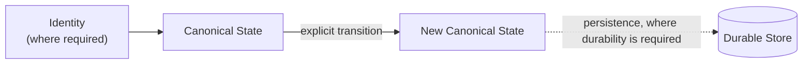

# Architecture

No application architecture is selected by this skeleton. Each adopted project records its own
component boundaries, dependency direction, data ownership, interfaces, runtime topology,
deployment, and constraints here.

## Canonical identity and data flow


This diagram is an identity-and-data-flow reference: it shows how one identifier stays traceable
from its definition through storage, domain logic, runtime, and UI. It is not a complete picture of
stateful architecture — it predates the state-and-identity policy below and does not show state,
transitions, or persistence. Treat it as a specialized identity-flow diagram, not as evidence that
identity alone describes a stateful capability. See "Canonical state and transitions" for the
authoritative relationship.

Every adopted project should define one canonical identity and data-flow chain. The diagram above
shows the reference direction:

```text
Manifest / config → Registry → Storage → Domain → Runtime / backend → UI / client
```

### Meaning of each layer

- **Manifest / config**: the declared source of identity, schema, and policy. Examples include
  configuration files, migration definitions, API contracts, and infrastructure manifests.
- **Registry**: a single place that resolves identifiers to concrete implementations or instances.
  The registry makes dependencies explicit and discoverable.
- **Storage**: the authoritative persistence layer. It owns the durable representation of each
  identity and its history.
- **Domain**: the business logic that interprets identifiers, enforces invariants, and decides
  state transitions.
- **Runtime / backend**: the executing process that exposes the domain to clients and integrations.
- **UI / client**: the human or machine interface that consumes the runtime without duplicating
  authority.

### Principles

- One canonical source of truth per identity. Do not let the same fact live in multiple authoritative
  stores.
- Traceability: every identifier used at runtime must be resolvable back to a manifest or config entry.
- Cleanup legacy, MVP, fallback, and parallel flows: do not leave duplicate or shadow identities in
  production. When a new flow replaces an old one, remove the old path after the new path is verified.
- The template does not prescribe a concrete registry, database, or runtime. The adopting project
  selects tools that satisfy the chain above.
- Identity and state are different concepts, and interfaces do not own shadow state. See
  `guardrails/state-and-identity-policy.md` for the canonical stateless/stateful distinction,
  identity/state/persistence relationship, and per-capability ownership rule.

## Canonical state and transitions

Canonical identity alone does not describe a stateful capability. For any capability that has
state, this is the authoritative relationship — not the identity-only diagram above:



Stateless capabilities skip this chain entirely: `input → canonical operation → result`, with no
identity or persistence added for symmetry. The full contract — stateless/stateful classification,
one canonical owner per stateful capability, transition rules, and the persistence boundary — is
defined once, in `guardrails/state-and-identity-policy.md`. This section only points to it; it does
not restate it.

## Project-specific architecture

For a real project, document:

- Component boundaries and dependency direction.
- Data ownership per component.
- Interfaces between layers.
- Runtime topology and deployment.
- Important constraints and non-functional requirements.
- How architecture constraints can be checked.
- Which tests reach each production boundary.
- Which state or process owner is authoritative.

Record significant choices with `templates/architecture-decision-template.md`.

The template's branch and evidence model does not select an application architecture or
verification tool.
