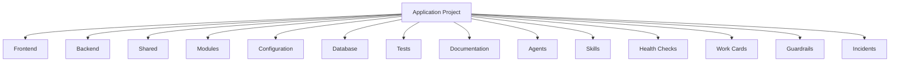
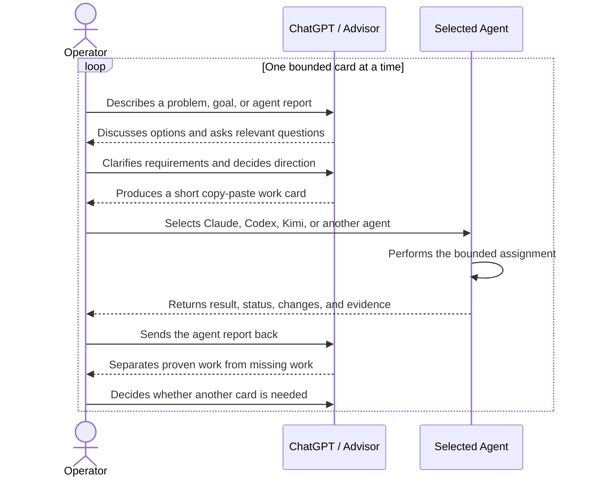

# Local Agent App Stack

A reusable, technology-neutral application project skeleton.

It provides standard locations for frontend, backend, shared modules, configuration, persistence, tests, documentation, agents, skills, health checks, work cards, project guardrails, and quality evidence.

The repository contains structure and templates only. It does not select a programming language, framework, database, AI model, runtime, deployment platform, or application architecture.

## Use as a GitHub template

Mark this repository as a template in GitHub, then choose **Use this template** to create a new
repository. Clone the new repository, complete `PROJECT.md`, record initial decisions in
`ARCHITECTURE.md`, and replace or extend placeholders only when the real project requires it.

## Repository overview

## How the operator works

## Structure

- `frontend/` — client-facing code and assets after a frontend approach is selected.
- `backend/` — server-side or application-service code after a backend approach is selected.
- `shared/` — contracts or utilities intentionally shared across project areas.
- `modules/` — bounded feature or capability modules.
- `config/` — safe configuration examples and configuration documentation.
- `database/` — persistence definitions and ordered migrations after storage is selected.
- `tests/` — unit, integration, and end-to-end tests.
- `agents/` — optional project-specific agent definitions.
- `skills/` — a reusable work-instruction library for agents selected by the operator.
- `health/` — evidence-based project-status checks that preserve unknown areas.
- `cards/` — lightweight work-card and status-report templates.
- `guardrails/` — shared project safety and quality rules.
- `quality/` — evidence requirements for distinct delivery and verification states.
- `incidents/` — incident documentation templates.
- `templates/` — reusable project, architecture, feature, and module documents.
- `docs/` — additional project documentation.
- `scripts/` — project verification and maintenance scripts.
- `.github/workflows/` — automation selected by the adopting project.

## Decisions deferred to each project

The adopting project chooses its programming languages, frontend and backend frameworks,
application boundaries, data store, migration tooling, configuration system, test tools,
deployment platform, observability, security controls, and any AI capabilities.

Agents are optional. Skills are available rather than automatically routed, health records only
verified status or unknowns, and quality documents define evidence without granting acceptance.
The operator selects resources and makes project decisions.

Use `bash scripts/verify-structure.sh --template` to verify the complete published template. In a
project created from the template, use `bash scripts/verify-structure.sh --project`; that mode
allows the optional `agents/`, `database/`, and `.github/workflows/` areas to be removed. Running
the script without an argument defaults to template mode. Both modes allow
additional project files and subdirectories.
