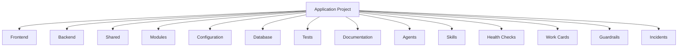
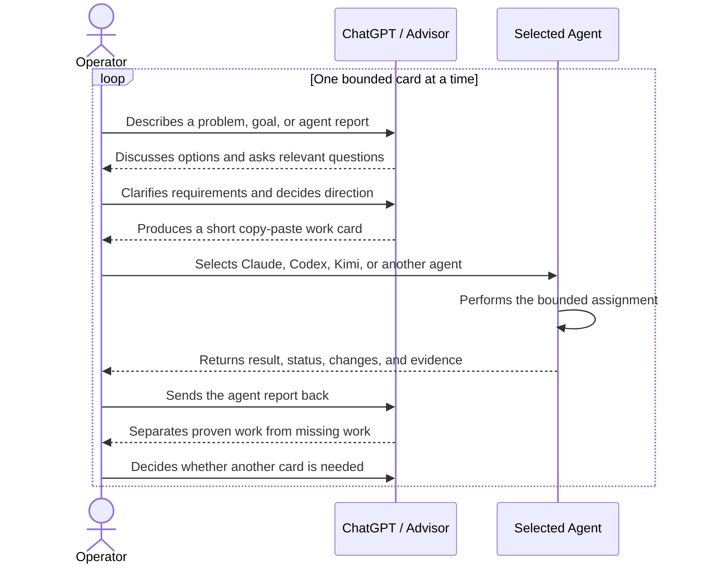
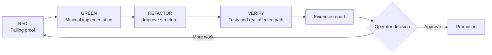
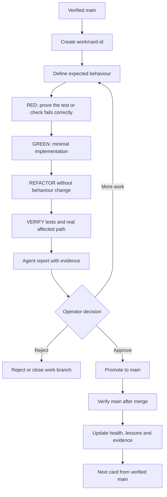
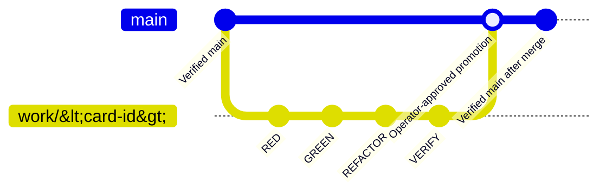

# Local Agent App Stack

## Operatorstyrd evidensdriven agentutveckling
WARNING — THIS IS NOT VIBE CODING

A reusable, technology-neutral application project skeleton.

## START HERE

This is a **template**, not a ready project. Do not start implementing product code immediately after fork or template use. Follow the adoption workflow first:

1. Read [`docs/adopting-the-template.md`](docs/adopting-the-template.md).
2. Fill in [`PROJECT.md`](PROJECT.md) and [`ARCHITECTURE.md`](ARCHITECTURE.md) for the adopted project.
3. Create the first specification card from [`cards/task-card-template.md`](cards/task-card-template.md).
4. Create `work/<card-id>` from verified `main`.
5. Define RED evidence or an equivalent verifiable proof before any implementation.

Only then should an agent receive a bounded card.

Human:

1. Complete [`PROJECT.md`](PROJECT.md) and [`ARCHITECTURE.md`](ARCHITECTURE.md) for an adopted project.
2. Create `work/<card-id>` from verified `main`.
3. Give the bounded card to the selected agent.

Agent:

1. Read [`AGENTS.md`](AGENTS.md).
2. Run the verified entrypoint checks:
   ```bash
   bash scripts/verify-structure.sh --template
   bash scripts/verify-operating-model.sh
   ```
3. Follow the guardrail chain in [`AGENTS.md`](AGENTS.md).

README instructions alone are documentation, not enforcement. `scripts/verify-structure.sh`,
`scripts/verify-operating-model.sh`, `scripts/command-gate.sh` integration, and an exclusive runner
or terminal adapter provide the executable boundary. See [`AGENTS.md`](AGENTS.md) for the current
entrypoint. Note that `scripts/agent-start.sh` and the guardrail registry existed on an earlier
frontier but are not present on `main`; do not rely on them until an explicit frontier restores them.

This template is designed for conversation-driven, operator-controlled, card-based development using test-driven development, evidence from the real affected path, and a protected two-branch workflow.

It provides standard locations for frontend, backend, shared modules, configuration, persistence, tests, documentation, agents, skills, health checks, work cards, project guardrails, and quality evidence.

The repository contains structure and templates only. It does not select a programming language, framework, database, AI model, runtime, deployment platform, or application architecture.

## Template vs project

- `template`: the complete published skeleton inventory, including optional directories such as `agents/`, `database/migrations/`, and `.github/workflows/`.
- `project`: an adopted repository with a defined project specification recorded in [`PROJECT.md`](PROJECT.md).

The transition from template to project is an explicit operator decision. It does **not** happen by deleting directories. Optional directories may only be removed after the adoption contract is satisfied and the operator decides they are no longer needed.

This template does not provide automatic mode switching between `template` and `project`.

## Use as a GitHub template

Mark this repository as a template in GitHub, then choose **Use this template** to create a new
repository. Clone the new repository, read [`docs/adopting-the-template.md`](docs/adopting-the-template.md), complete [`PROJECT.md`](PROJECT.md), record initial decisions in
[`ARCHITECTURE.md`](ARCHITECTURE.md), and create the first frontier card before any implementation work.

## Repository overview



## How the operator works

The operator chooses the agent; the advisor writes the bounded card; and the selected agent works
on that card's isolated work branch. The agent reports evidence but does not approve its own work.
The report returns to the operator, and any next card is based on what the report actually proves.



## Test-driven development

- RED: Reproduce the expected behaviour or failure before implementation where practical.
- GREEN: Make the smallest implementation that makes the proof pass.
- REFACTOR: Improve structure without changing behaviour.
- VERIFY: Verify relevant tests and the real affected path.
- Tests provide evidence; the operator determines acceptance.
- GUI, audio, 3D, documentation, and architecture use an appropriate verifiable alternative when
  conventional TDD does not fit.

Every code card begins with a defined failing proof where practical and ends with evidence from
the real affected path. Tests guide implementation; evidence and the operator determine acceptance.



## Test-driven card lifecycle



## Protected two-branch workflow



## Structure

- `frontend/` — client-facing code and assets after a frontend approach is selected.
- `backend/` — server-side or application-service code after a backend approach is selected.
- `shared/` — contracts or utilities intentionally shared across project areas.
- `modules/` — bounded feature or capability modules.
- `config/` — safe configuration examples and configuration documentation.
- `database/` — persistence definitions and ordered migrations after storage is selected.
- `tests/` — unit, integration, and end-to-end tests.
- `agents/` — optional project-specific agent definitions.
- `skills/` — a reusable work-instruction library for agents selected by the operator.
- `health/` — evidence-based project-status checks that preserve unknown areas.
- `cards/` — lightweight work-card and status-report templates.
- `guardrails/` — shared project safety and quality rules.
- `quality/` — evidence requirements for distinct delivery and verification states.
- `incidents/` — incident documentation templates.
- `templates/` — reusable project, architecture, feature, and module documents.
- `docs/` — additional project documentation.
- `scripts/` — project verification and maintenance scripts.
- `workflow/` — operator-controlled card, TDD, evidence, and branch lifecycle guidance.
- `.github/workflows/` — automation selected by the adopting project.

## Decisions deferred to each project

The adopting project chooses its programming languages, frontend and backend frameworks,
application boundaries, data store, migration tooling, configuration system, test tools,
deployment platform, observability, security controls, and any AI capabilities.

Agents are optional. Skills are available rather than automatically routed, health records only
verified status or unknowns, and quality documents define evidence without granting acceptance.
The operator selects resources and makes project decisions.

Use `bash scripts/verify-structure.sh --template` to verify the complete published template. In a
project created from the template, use `bash scripts/verify-structure.sh --project`; that mode
allows the optional `agents/`, `database/`, and `.github/workflows/` areas to be removed. Running
the script without an argument defaults to template mode. Both modes allow
additional project files and subdirectories.

Run `bash scripts/verify-operating-model.sh` to check that the template's required operating-model
documents and key contracts are present. This is a documentation contract check; it does not
configure remote branch protection, run project tests, approve work, or promote branches.

## Command safety

`scripts/command-gate.sh` provides an optional pre-execution boundary for agent-controlled terminal
commands. It classifies known safe commands as `ALLOW`, risky or ambiguous commands as `REVIEW`,
and known destructive or bypass commands as `BLOCK`. REVIEW requires an explicit operator decision;
BLOCK never executes through the wrapper. Decisions are logged locally without full arguments.

The gate is automatic enforcement only for commands routed through it. It is not global terminal
interception. Adopting projects must connect their agent runner or terminal adapter to the wrapper
and restrict direct execution paths if they require complete technical enforcement.

## Agent bootstrap and guardrail registry

The intended agent bootstrap is `scripts/agent-start.sh`, backed by `guardrails/registry.toml` and
`scripts/registry-lib.sh`. These components existed on the historical frontier
`work/AGENT_BOOTSTRAP_AND_GUARDRAIL_REGISTRY_V1` but were never merged to `main`. The published
template therefore does not currently provide automatic startup, a registry digest, or a session
receipt in `.local/agent-session.env`.

Until an explicit frontier restores them, use the verified entrypoint checks instead:

```bash
bash scripts/verify-structure.sh --template
bash scripts/verify-operating-model.sh
```

`scripts/command-gate.sh` is available for command classification. Startup does not install
dependencies or start product processes.

## Adoption guide

For the complete first-project workflow, see [`docs/adopting-the-template.md`](docs/adopting-the-template.md).
