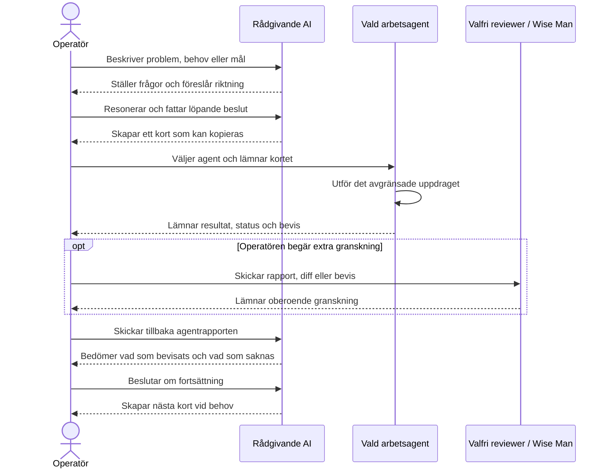

# Local Agent App Stack

A neutral, reusable project skeleton for applications developed with optional AI agents under
direct operator control. It is a working-method template, not a finished application and not a
preselected technology stack.

The method is **Conversation-driven, operator-controlled, card-based multi-agent development.**

## How work actually proceeds

1. The operator describes a problem, need, or goal to an advisory AI.
2. The operator and advisor reason freely until the next concrete step is clear.
3. The advisor writes a short, bounded card that the operator can copy directly.
4. The operator chooses which agent receives the card.
5. The selected agent performs the bounded assignment.
6. The agent returns results, status, and verifiable evidence.
7. The operator sends the report back to the advisor.
8. The operator and advisor assess what is proven, what is missing, and what the next card should be.

## Method locks

- The operator owns the process and makes every decision.
- The advisor reasons with the operator and writes cards; it does not allocate work autonomously.
- The operator chooses the working agent. Agent selection is never automatic or predetermined.
- Agents, skills, and health checks are optional resources.
- Reviewers, Wise Man review, architecture review, risk analysis, and complexity analysis are used only when the operator decides the task requires them.
- A working agent may report results but may not approve its own work.
- A card is short, bounded, and directly copyable.
- The next card is derived from the actual report, never from assumptions.
- No status `KLAR` is valid without relevant evidence and the operator's decision.

## Repository map

- `agents/` and `skills/`: optional reusable resources and their templates.
- `health/`: selectable project and runtime health lenses.
- `workflow/`: the operator-controlled card loop, handoff, evidence, and status rules.
- `guardrails/`: canonical policies and their enforcement map.
- `cards/`: directly copyable task, analysis, review, cleanup, status, and closure forms.
- `incidents/`: evidence-preserving incident records and guardrail feedback.
- `templates/`: neutral project, architecture, agent, and health definitions.
- `frontend/`, `backend/`, `modules/`, `config/`, `database/`: deliberately empty technical slots.
- `tests/`, `scripts/`, `docs/`: verification, automation, and project documentation slots.
- `.github/workflows/`: optional repository automation slot.

## Start a project

1. Complete `PROJECT.md` and `templates/project-context.md`.
2. Record real architecture decisions; do not infer them from this skeleton.
3. Select only the agents, skills, health checks, and reviewers needed for the current card.
4. Run `bash scripts/verify-skeleton.sh` before the initial commit and after structural changes.
