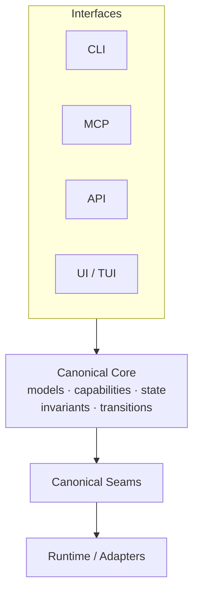
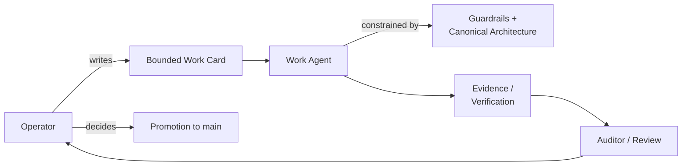
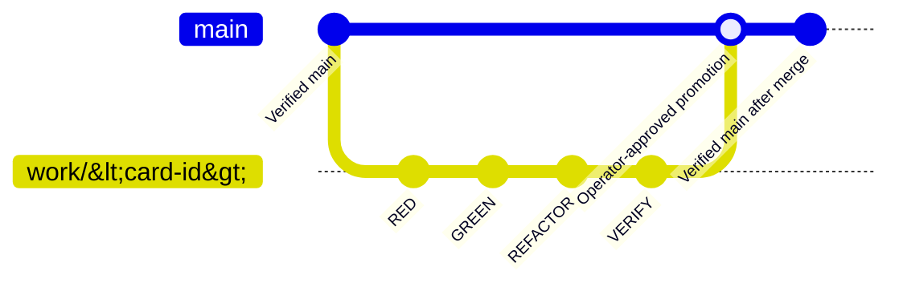
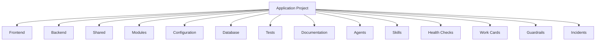

# Local Agent App Stack

*A reusable, technology-neutral architecture and guardrail skeleton for building reliable,
capability-based software systems.*

This is not vibe coding. Development here is operator-controlled, evidence-driven, and card-based —
every change traces to a bounded work card, a failing proof, and an operator decision.
*(Operatorstyrd, evidensdriven agentutveckling.)*

## What this is

An architecture and guardrail skeleton, not an application. It provides canonical structure,
ownership rules, dependency direction, identity/state principles, and operator-controlled workflow
discipline for a project that has not been built yet. This template is designed for
conversation-driven, operator-controlled, card-based development using test-driven development,
evidence from the real affected path, and a protected two-branch workflow.

## What this is not

- Not a framework, library, or runtime you import.
- Not a finished application, MCP server, or agent platform — those are things you build *with* it.
- Not tied to any single AI vendor, coding tool, or programming language.
- Not something to start implementing product code against immediately — see
  [Getting started](#getting-started).

## What it's for

The skeleton is deliberately technology-neutral. It fits any project that needs a disciplined
canonical core plus guardrails, including:

- MCP servers
- Tool / capability engines
- Backend and service engines
- Research or crawling engines
- Monitoring systems
- Agent platforms
- Conventional applications

It does not implement any of these itself — it gives a new project the architecture, contracts,
guardrails, workflow, and verification structure to build one reliably.

## Decisions deferred to each project

The adopting project chooses its programming languages, frameworks, application boundaries, data
store, migration tooling, configuration system, test tools, deployment platform, observability,
security controls, and any AI capabilities. Agents are optional; skills are available rather than
automatically routed; health records only verified status or unknowns; quality documents define
evidence without granting acceptance. The operator selects resources and makes project decisions.

## Canonical core principle

Every interface — CLI, MCP, API, web/UI, TUI, or any other consumer — depends on the *same*
canonical core instead of implementing its own competing version of the business/domain logic.



See [`ARCHITECTURE.md`](ARCHITECTURE.md) for the full canonical identity/data-flow chain and
[`guardrails/source-of-truth-policy.md`](guardrails/source-of-truth-policy.md) for the ownership
rule this depends on.

## Stateless vs. stateful

Every capability is classified as one or the other before it's built:

**Stateless** — `input → canonical operation → result`. Bounded execution, no lifecycle, no
identity or persistence introduced merely for symmetry.

**Stateful** — `identity (where required) → canonical state → explicit transition → new canonical
state → persistence (where durability is required)`. Each stateful capability has one canonical
identity model, one state vocabulary, one transition vocabulary, and one canonical owner.
Interfaces may observe state or request a transition; they never own a competing copy of the
lifecycle.

Identity ≠ state. State ≠ persistence. Storage ≠ canonical domain state. See
[`guardrails/state-and-identity-policy.md`](guardrails/state-and-identity-policy.md) for the full
contract.

## Operator-controlled development

The human operator is the final authority for every decision that matters: scope, acceptance, and
promotion to `main`. The agent reports evidence but does not approve its own work. The report
returns to the operator, and any next card is based on what the report actually proves.



Canonical roles — operator, advisor, work agent, auditor — and today's tool mapping are defined in
[`docs/human-in-the-loop.md`](docs/human-in-the-loop.md). Roles are vendor-independent; the tools
behind them can change without changing the control model.

Every code card follows RED → GREEN → REFACTOR → VERIFY → REPORT → operator decision → promotion,
detailed in [`workflow/operator-tdd-card-loop.md`](workflow/operator-tdd-card-loop.md) and
[`quality/tdd-and-evidence-policy.md`](quality/tdd-and-evidence-policy.md).

## Guardrails at a glance

Guardrails are written rules kept in their own canonical files — this repository does not claim
automatic enforcement it doesn't have. See [`guardrails/README.md`](guardrails/README.md) for the
complete baseline and [`guardrails/enforcement-map.md`](guardrails/enforcement-map.md) for what's
actually enforced today.

`main` is protected; all implementation happens on a short-lived `work/<card-id>` branch, merged
only after operator review:



Agent-controlled terminal commands classify as `ALLOW`, `REVIEW`, or `BLOCK` through
`scripts/command-gate.sh` when it's used — an optional pre-execution boundary, not global terminal
interception. See [`docs/verification-and-guardrails.md`](docs/verification-and-guardrails.md) and
[`guardrails/command-runner-contract.md`](guardrails/command-runner-contract.md) for the full
contract and current enforcement status.

## Test-driven card lifecycle

A project moves from template or fork to closure one frontier at a time. Each frontier defines
scope, a work branch, RED evidence, implementation, verification, and operator review before
promotion. See [`docs/adopting-the-template.md`](docs/adopting-the-template.md) for the complete
adoption lifecycle.


## Getting started

This is a **template**, not a ready project. Do not start implementing product code immediately.

1. Read [`docs/adopting-the-template.md`](docs/adopting-the-template.md).
2. Fill in [`PROJECT.md`](PROJECT.md) and [`ARCHITECTURE.md`](ARCHITECTURE.md) for the adopted project.
3. Create the first specification card from [`cards/task-card-template.md`](cards/task-card-template.md).
4. Create `work/<card-id>` from verified `main`.
5. Define RED evidence or an equivalent verifiable proof before any implementation.

Only then should an agent receive a bounded card.

**Human:** complete `PROJECT.md`/`ARCHITECTURE.md`, create `work/<card-id>`, hand the bounded card
to the selected agent.

**Agent:** read [`AGENTS.md`](AGENTS.md), then run the verified entrypoint checks before touching
anything:

```bash
bash scripts/verify-structure.sh --template
bash scripts/verify-operating-model.sh
```

README instructions alone are documentation, not enforcement — `scripts/verify-structure.sh`,
`scripts/verify-operating-model.sh`, and `scripts/command-gate.sh` (once wired to a real runner or
terminal adapter) are the executable boundary. See [`AGENTS.md`](AGENTS.md) for the current
entrypoint; `scripts/agent-start.sh` and a guardrail registry were drafted on a historical frontier
but never merged to `main` — don't rely on them.

## Repository structure



- `frontend/`, `backend/`, `shared/`, `modules/` — client, server, shared, and bounded-capability
  code after the adopting project selects its approach.
- `config/`, `database/` — configuration and persistence, undecided until adopted.
- `tests/` — unit, integration, and end-to-end tests.
- `agents/`, `skills/` — optional agent definitions and a reusable work-instruction library.
- `health/` — evidence-based status checks that preserve unknown areas honestly.
- `cards/`, `guardrails/`, `quality/`, `incidents/`, `templates/` — work-card, safety, evidence,
  incident, and reusable-document templates.
- `docs/`, `workflow/` — adoption guides and the card/TDD/branch lifecycle.
- `scripts/` — structure, operating-model, and command-safety verification.

## Template vs. project

- `template` — the complete published skeleton inventory, including optional directories such as
  `agents/`, `database/migrations/`, and `.github/workflows/`.
- `project` — an adopted repository with a defined project specification recorded in
  [`PROJECT.md`](PROJECT.md).

The transition is an explicit operator decision recorded in `PROJECT.md` — it never happens
implicitly by deleting directories. See
[`docs/adopting-the-template.md`](docs/adopting-the-template.md) for the full lifecycle.

## Use as a GitHub template

Mark this repository as a template, then **Use this template** to create a new repository. Clone
it, read [`docs/adopting-the-template.md`](docs/adopting-the-template.md), complete `PROJECT.md`,
record initial decisions in `ARCHITECTURE.md`, and create the first frontier card before any
implementation work.

Use `bash scripts/verify-structure.sh --template` to verify the complete published template, or
`--project` after optional directories are removed by operator decision. Both modes allow
additional project files and subdirectories.

## Learn more

- [`docs/adopting-the-template.md`](docs/adopting-the-template.md) — canonical first-project workflow.
- [`docs/human-in-the-loop.md`](docs/human-in-the-loop.md) — operator authority and agent role contracts.
- [`docs/verification-and-guardrails.md`](docs/verification-and-guardrails.md) — verification commands, command gate, and what the guardrails block.
- [`guardrails/README.md`](guardrails/README.md) — the full guardrail baseline.
- [`guardrails/state-and-identity-policy.md`](guardrails/state-and-identity-policy.md) — the canonical identity/state/transition/persistence contract.
- [`guardrails/command-runner-contract.md`](guardrails/command-runner-contract.md) — the request/result contract a project-owned command runner must satisfy.
- [`workflow/`](workflow/README.md) and [`quality/`](quality/README.md) — card lifecycle, evidence, and TDD policy.
- [`AGENTS.md`](AGENTS.md) — mandatory agent bootstrap and command policy.

## License

This repository is licensed under the [Apache License 2.0](LICENSE). You may use, modify, and
distribute copies of this repository subject to the terms of that license. The [`LICENSE`](LICENSE)
file at the root of this repository is the authoritative source of the license terms; this section
is a summary only.
