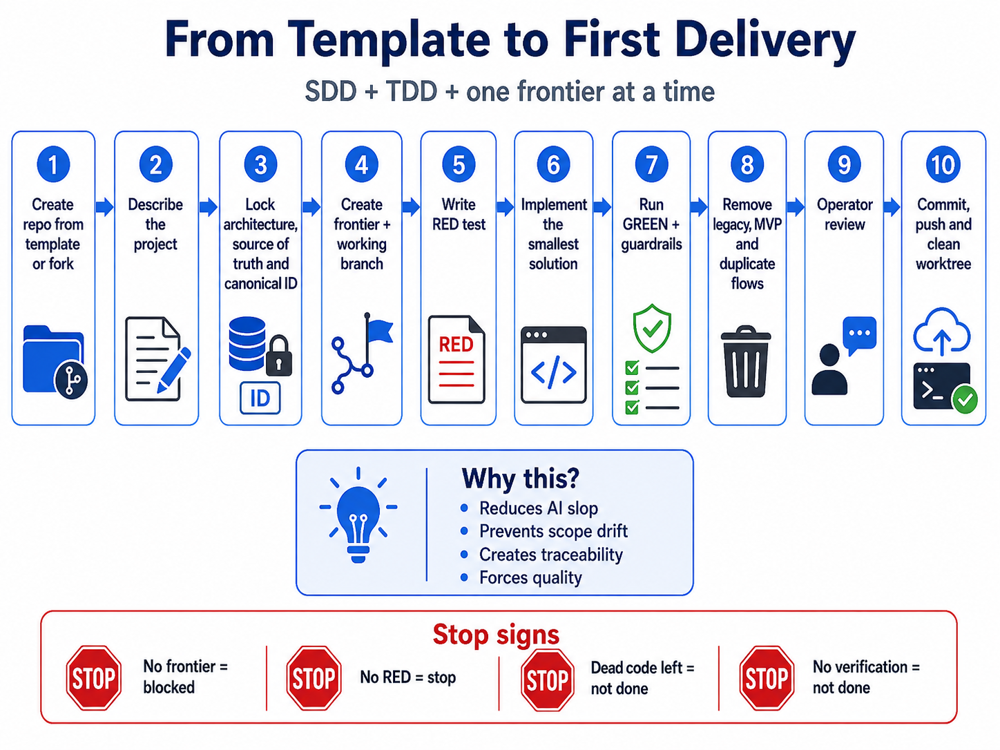

# Adopting the template

This is the canonical guide for turning `Agentxx7/local-agent-app-stack` into a defined project. Read it before writing product code, before deleting optional directories, and before creating the first work branch.

## What this template is

A technology-neutral skeleton for Specification-Driven Development (SDD) with test-driven design (TDD). It does **not** choose a language, framework, database, runtime, or deployment platform. It provides a common directory layout, card-based workflow, guardrails, and verification scripts.

## What this template is not

A starting point for immediate implementation. The template blocks writing work until the project is described, scoped, and given a valid frontier card.

## Audience

A human operator who has just forked or created a repository from the GitHub template. No prior knowledge of Nightstalker, Lilith, AI desktops, or voice interfaces is assumed.

## First-project workflow



The diagram above shows the full path from template or fork to closure. Each phase produces a
verifiable artifact before the next phase begins. The details below expand each step.

### Phase 1 — Create the repository

1. Use **Use this template** on GitHub or fork the repository according to your team's policy.
2. Change the repository name to match the new project.
3. Fill in the basic metadata: description, README heading, and `PROJECT.md` identity fields.
4. Run the read-only structure verification:
   ```bash
   bash scripts/verify-structure.sh --template
   bash scripts/verify-operating-model.sh
   ```
5. Do **not** start implementing product code. Do **not** delete optional directories yet.

### Phase 2 — Describe the project

Create the first specification card from `cards/task-card-template.md`. It must define at least:

- Project name
- Problem to solve
- Target users or operator
- First usable outcome
- In scope
- Out of scope
- Technology and runtime decisions already locked
- Source of truth
- Security and data requirements
- Architectural layers
- Canonical ID and data-flow principle
- Verification strategy

Use the copy-paste template at the end of this guide as a starting point.

### Phase 3 — Create the first frontier

Every implementation needs a bounded frontier card with:

- A unique frontier ID
- A work branch named `work/<card-id>` created from verified `main`
- Defined affected paths
- Acceptance criteria
- Stop rule
- Verification method
- Explicit out-of-scope items

A frontier must be small enough to finish in one card. Do **not** create a single "build the whole project" frontier.

### Phase 4 — Test-driven design

For code frontiers, follow this order:

1. Define expected behaviour and acceptance criteria.
2. Write a reproducing RED test or an equivalent verifiable proof.
3. Show that the test fails for the right reason.
4. Implement the smallest change that makes the test pass.
5. Run GREEN.
6. Run relevant regression tests, structure checks, and guardrails.
7. Remove dead, parallel, or replaced code.
8. Report evidence.

For documentation or pure configuration frontiers where a conventional test is not reasonable, define another machine-checkable or verifiable proof in the card. See `quality/tdd-and-evidence-policy.md` for the full list of alternatives.

### Phase 5 — Template to project

Understand the difference:

- `template` means the complete published skeleton inventory.
- `project` means an adopted repository with a defined project specification.

The transition must be explicit:

- It does **not** happen implicitly by deleting directories.
- Project status is an operator decision recorded in `PROJECT.md` and the first card.
- Missing or contradictory status must block work fail-closed.
- Optional directories such as `agents/`, `database/migrations/`, and `.github/workflows/` may only be removed after the adoption contract is satisfied and the operator has decided the project no longer needs them.

This template does not provide automatic mode switching between `template` and `project`. The operator records the decision.

### Phase 6 — Closure

A frontier is not complete until:

- Acceptance criteria are verified
- Tests and guardrails pass
- The operator has reviewed the result
- Changes are committed
- Relevant refs are pushed
- The worktree is clean

Only then can the operator decide whether to promote the work branch to `main`.

## Verification commands

Use the real scripts that exist in this repository:

```bash
bash scripts/verify-structure.sh --template   # when the full skeleton is still required
bash scripts/verify-structure.sh --project    # after optional directories are removed by operator decision
bash scripts/verify-operating-model.sh        # documentation contract check
bash scripts/command-gate.sh --check-only -- <command>   # classify a command before execution
```

There is no `agent-start.sh`, `verify.sh`, `doctor`, or `preflight` script on `main`. These tools existed on the historical frontier `work/AGENT_BOOTSTRAP_AND_GUARDRAIL_REGISTRY_V1` but were never merged. Do not invent or rely on them until an explicit frontier restores them.

## Command safety

`scripts/command-gate.sh` is the optional pre-execution boundary for agent-controlled terminal commands. It classifies commands as `ALLOW`, `REVIEW`, or `BLOCK`. `REVIEW` requires an explicit operator decision ID, reason, and exact argv scope. `BLOCK` must not execute through the wrapper.

The gate only enforces commands routed through it. It is not global terminal interception. An adopting project must connect its agent runner or terminal adapter to the wrapper for complete technical enforcement.

## Canonical locations

- Full adoption workflow: `docs/adopting-the-template.md` (this file)
- First project specification: `docs/first-project-specification.md`
- Verification and guardrails: `docs/verification-and-guardrails.md`
- Card templates: `cards/task-card-template.md` and `cards/status-report-template.md`
- Workflow: `workflow/operator-tdd-card-loop.md` and `workflow/two-branch-model.md`
- Agent entrypoint: `AGENTS.md`

## First project copy-paste template

Copy this into `PROJECT.md` and into your first card, then replace the neutral examples with project-specific facts.

```markdown
# Project identity

- Name: Example Service Portal
- Repository: github.com/example-org/example-service-portal
- Owner: Platform team / operator Alice

# Problem statement

Teams currently request access to internal services through ad-hoc chat messages and spreadsheets. There is no audit trail, no consistent review, and no automated provisioning.

# Intended users

- Internal service requesters
- Service owners who approve access
- Platform operators who audit decisions

# First usable outcome

A web form where a requester can submit an access request and a service owner can approve or reject it. The decision is logged and visible to both parties.

# Locked decisions

- Runtime: Node.js LTS on Linux containers
- Web framework: Express
- Database: PostgreSQL 16
- Primary language: TypeScript
- Version control: GitHub with protected `main`
- Authentication: Existing corporate SSO

# Architecture boundaries

- Web frontend (server-rendered HTML)
- HTTP API layer
- Request and approval domain service
- PostgreSQL persistence
- Audit log writer
- No external integrations in the first frontier

# Canonical data flow

1. Requester submits `AccessRequest` with `requesterId`, `serviceId`, `justification`.
2. System stores the request with status `PENDING`.
3. Service owner receives a notification link.
4. Service owner calls `POST /requests/{id}/decision` with `DECISION` and `reason`.
5. System updates status and appends an immutable `AuditEntry`.
6. Requester and service owner can read the request and its audit trail.

# Source of truth

The PostgreSQL database is the source of truth for request state and audit history. Logs are read-only replicas for observability.

# Security and data handling

- All access requires SSO authentication.
- Requesters may only read their own requests.
- Service owners may only decide requests for services they own.
- Audit entries are immutable and never deleted.
- PII is limited to corporate user IDs; free-text justification is optional.

# In scope

- Submit and decide access requests
- Read request and audit trail
- Basic role check (requester / owner / operator)
- Local development setup with Docker Compose

# Out of scope

- Automatic provisioning to target services
- Email or push notifications
- Batch imports or migrations
- Public internet access

# First frontier

- Card ID: `ESP-001`
- Work branch: `work/ESP-001`
- Goal: A requester can submit an access request and read it back.
- Affected paths: `backend/src/requests/`, `database/migrations/`, `tests/unit/requests/`
- Out of scope for this frontier: approval decision, owner role check, notifications

# RED evidence

A failing test `POST /requests returns 201 and stores the request` that fails because the route and table do not exist yet.

# Acceptance criteria

- `POST /requests` returns `201 Created` with the stored request body.
- `GET /requests/{id}` returns `200 OK` for the requester who created it.
- `GET /requests/{id}` returns `404 Not Found` for an unknown ID.
- Unit tests for request validation exist and pass.
- Migration creates the `access_requests` table with required columns.

# Verification commands

```bash
bash scripts/verify-structure.sh --project
bash scripts/verify-operating-model.sh
npm run test:unit
npm run test:integration
```

# Stop conditions

- Any required verification command fails.
- Scope expands beyond the first frontier.
- Operator review is blocked.
- Worktree contains uncommitted changes at report time.
```
