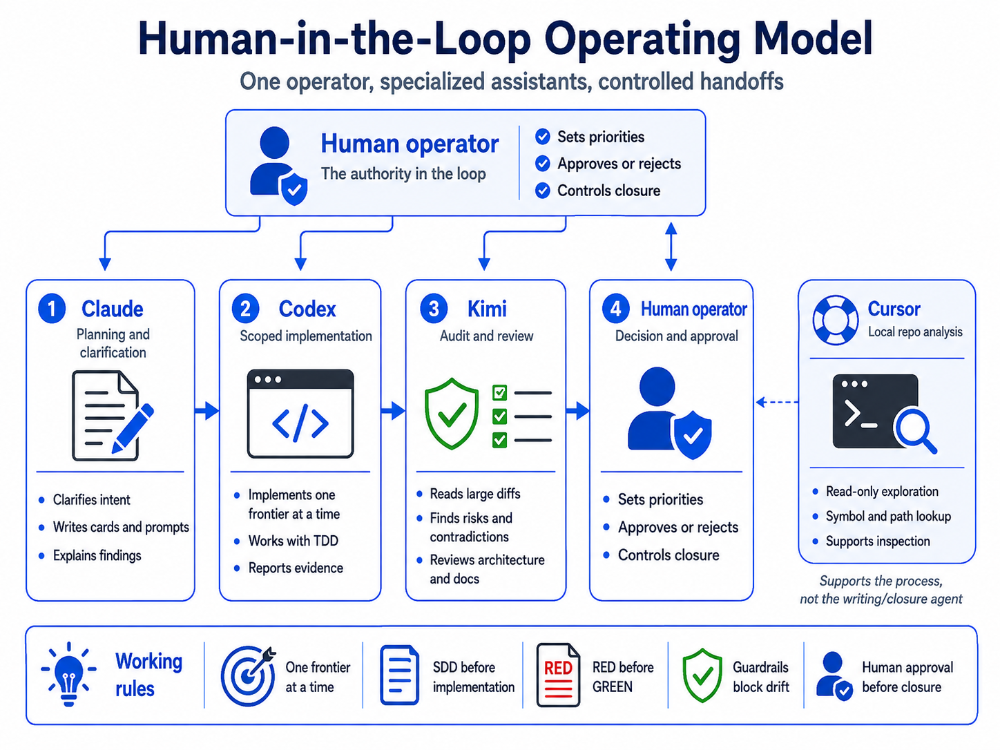

# Human-in-the-loop operating model

This template is conversation-driven, operator-controlled, and card-based. The human operator is
the final authority for every decision that matters.

## Human operator

The operator:

- Sets priorities and decides what problem to solve next.
- Chooses the advisor and the work agent for each frontier.
- Defines scope, acceptance criteria, and stop conditions.
- Accepts or rejects evidence.
- Controls promotion to `main` and closure of work branches.
- Is the final decision authority. No agent may approve its own work.

## Advisor role

The advisor helps the operator reason, plan, and clarify. It may:

- Ask questions until the next bounded step is clear.
- Produce copy-paste work cards.
- Explain findings and trade-offs.

The advisor does not implement, does not execute commands in the repository, and does not decide
promotion.

## Work agent

The work agent performs a bounded implementation frontier. It:

- Works only on the isolated `work/<card-id>` branch created from verified `main`.
- Follows RED, GREEN, REFACTOR, VERIFY, REPORT.
- Reports actual status, changes, tests, evidence, uncertainty, and remaining gaps.
- Stops and reports after commit and push.

The work agent does not approve its own work, does not promote to `main`, and does not mix scope
from another card.

## Auditor / reviewer

The auditor reviews large diffs, finds risks, contradictions, and architectural problems, and can
perform explicitly assigned bounded review frontiers. It does not replace the operator.

## Read-only exploration

Read-only exploration supports symbol lookup, path inspection, and local repository analysis. It
does not write code, does not close frontiers, and does not act as a build agent.

## Current tool mapping

The canonical roles above are independent of any specific vendor. The table below shows the current
tool mapping used in this operating model. A future project may map the same canonical roles to
different tools without changing the control model.

| Canonical role | Current tool | Responsibility |
|---|---|---|
| Human operator | Human operator | Sets priorities, approves or rejects, controls closure. Is the only final decision authority. |
| Advisor / planner | Claude | Clarifies intent, drafts cards and prompts, explains findings. Does not approve closure. |
| Work agent | Codex | Implements one scoped frontier at a time using TDD and reports evidence. |
| Auditor / reviewer | Kimi | Reviews large diffs, architecture, contradictions, and risks. May also run explicitly assigned, clearly bounded documentation or repair frontiers. |
| Read-only exploration | Cursor | Local read-only repository inspection, symbol and path lookup. Is not a writing build agent or closure agent. |

### Mapping rules

- The human operator remains the only final decision authority regardless of tool.
- Claude plans and clarifies but does not approve closure.
- Codex is the primary writing implementation agent for bounded code frontiers.
- Kimi is primarily auditor/reviewer, and may perform explicitly assigned bounded frontiers.
- Cursor is read-only and must not be used as a writing build agent or closure agent.
- Replacing a tool does not change the canonical role, control flow, or operator authority.

## Typical flow

1. The operator describes a problem, goal, observation, or agent report to the advisor.
2. The operator and advisor reason until the next bounded step is clear.
3. The advisor writes a copy-paste work card.
4. The operator selects a work agent and gives it the card.
5. The work agent implements on the isolated branch and reports evidence.
6. The operator returns the report to the advisor for separation of proven and missing work.
7. The operator decides whether to create a correction, request review, reject, or approve promotion.

## Link to the full workflow

See `docs/adopting-the-template.md` for the complete adoption lifecycle.
