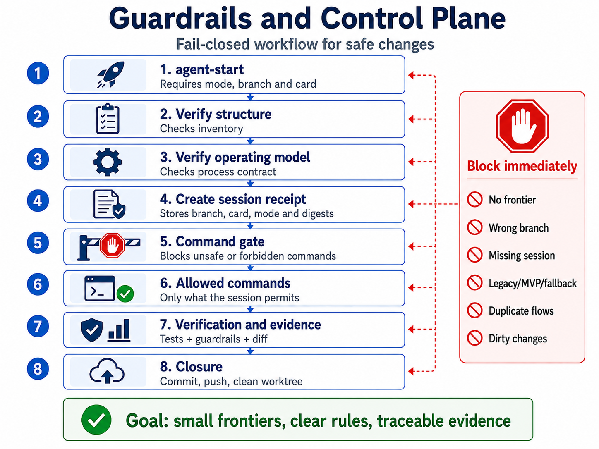

# Verification and guardrails

This guide explains how the template verifies structure, operating-model contracts, and command safety. It is written for the operator who adopts the template.



The control plane is designed to fail closed. Verification, command classification, session
integrity, and closure checks block writing work until the project is defined, the frontier is
valid, and the operator has reviewed the evidence.

## What the guardrails block

The template's design blocks writing work until:

1. The project is described in `PROJECT.md` and the first card.
2. Scope and architecture are defined.
3. A valid frontier card exists.
4. The correct `work/<card-id>` branch exists from verified `main`.
5. RED evidence or another verifiable acceptance proof is defined.

The scripts below are the actual verification tools. They do not enforce remote branch protection or agent routing; those are host or runner responsibilities.

## Structure verification

`scripts/verify-structure.sh` checks that the required directories and files exist.

```bash
bash scripts/verify-structure.sh --template
```

Use `--template` while the full published inventory is still required. It expects directories such as `agents/`, `database/migrations/`, and `.github/workflows/` to be present.

```bash
bash scripts/verify-structure.sh --project
```

Use `--project` after the operator has decided that optional directories may be removed. The `--project` mode still requires the core operating-model files.

## Operating-model contract

`scripts/verify-operating-model.sh` checks that the required operating-model documents exist, are non-empty, and contain key phrases that preserve the workflow. It rejects wording that allows direct implementation on `main`, agent self-approval, promotion without an explicit operator decision, multiple cards on one work branch, or mixed scope.

```bash
bash scripts/verify-operating-model.sh
```

## Command safety

`scripts/command-gate.sh` classifies commands for agent-controlled execution:

```bash
bash scripts/command-gate.sh --check-only -- <command> <args...>
```

- `ALLOW`: safe to run.
- `REVIEW`: requires an operator decision ID, reason, and exact argv scope.
- `BLOCK`: must not execute through the wrapper.

The gate is pre-execution enforcement only when the agent runner routes commands through it. It is not global terminal interception.

## What does not exist on `main`

This template on `main` does **not** contain:

- `scripts/agent-start.sh`
- `scripts/verify.sh`
- `guardrails/registry.toml`
- `scripts/registry-lib.sh`
- `doctor` or `preflight` commands
- Automatic mode switching between `template` and `project`
- Automated agent routing or approval
- Remote branch protection configuration

`scripts/agent-start.sh` and `scripts/verify.sh` existed on the historical frontier
`work/AGENT_BOOTSTRAP_AND_GUARDRAIL_REGISTRY_V1` but were never merged to `main`. Do not invent or
rely on them until an explicit frontier restores them.

## TDD verification

Every code frontier must:

1. Start with a failing RED test or justified alternative.
2. Reach GREEN with the smallest implementation.
3. Pass REFACTOR without changing behaviour.
4. Pass VERIFY, including the real affected path and relevant regression tests.
5. End with REPORT that binds evidence to the exact commit.

See `quality/tdd-and-evidence-policy.md` and `workflow/operator-tdd-card-loop.md` for the complete policy.

## Verification during adoption

After creating a repository from the template but before deleting optional directories, run:

```bash
bash scripts/verify-structure.sh --template
bash scripts/verify-operating-model.sh
```

After the operator has decided the project no longer needs optional directories, run:

```bash
bash scripts/verify-structure.sh --project
bash scripts/verify-operating-model.sh
```

## Link to the full workflow

See `docs/adopting-the-template.md` for the complete adoption lifecycle.
